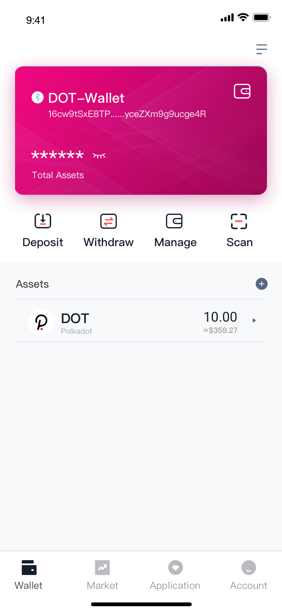
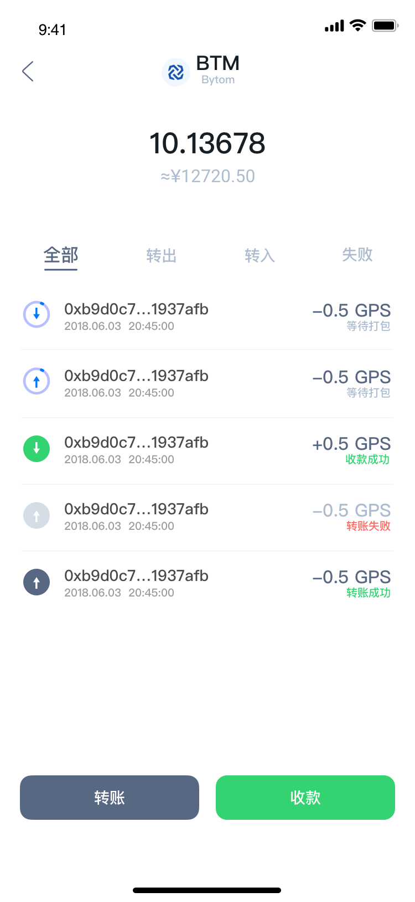

# ALLToken - Wallet for all token

## Download

later...

# Introduction

ALLToken is an open source,cross-platform wallet, built with [Flutter](https://flutter.dev/),now it is support bitcoin,ethereum,polkadot,more chain well be support in the future.

## Getting Started

Dependencies

- Flutter 1.22.x statble
- Dart 2.10.x

To get started

1. Clone the repo locally, via git clone https://github.com/CycanTech/ALLToken.git `<optional local path>`.
2. Install the dependencies by running `flutter pub get`.
3. In AndroidStudio, run `lib/main.dart` with arguments `--flavor=prod` on Android Devices, or just run `lib/main.dart` with no arguments on IOS.

## Contribution

Thank you for considering to help out with the source code! We welcome contributions from anyone on the internet, and are grateful for even the smallest of fixes!

## License

The ALLToken wallet is licensed under the [GPL 3.0 licensed](https://github.com/paritytech/polkadot/blob/master/LICENSE).